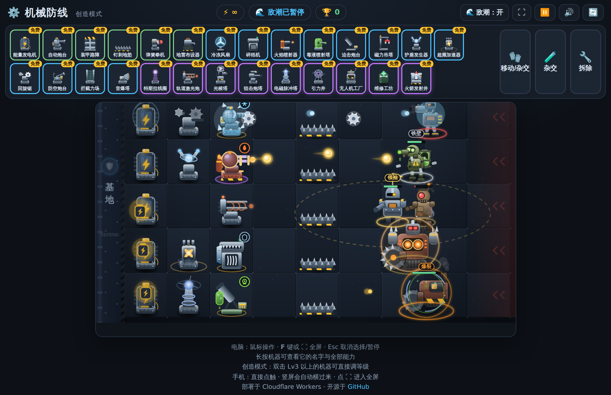
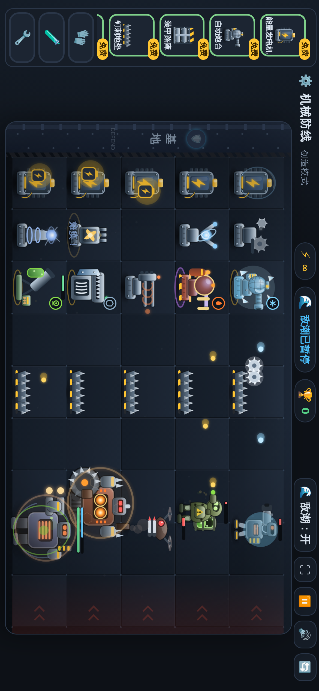
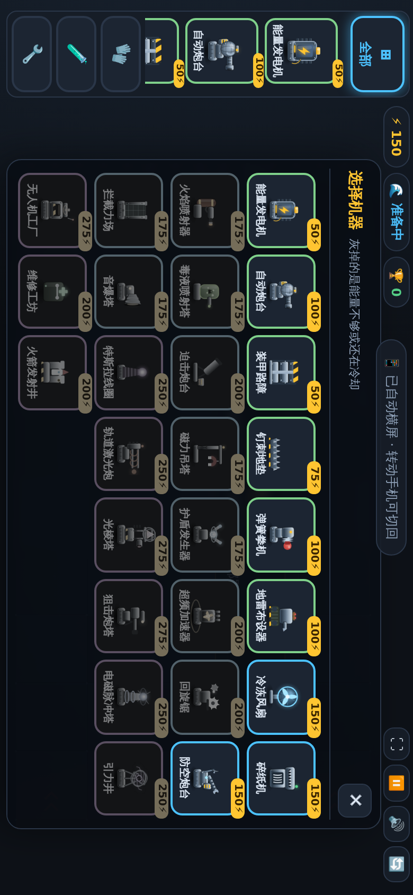
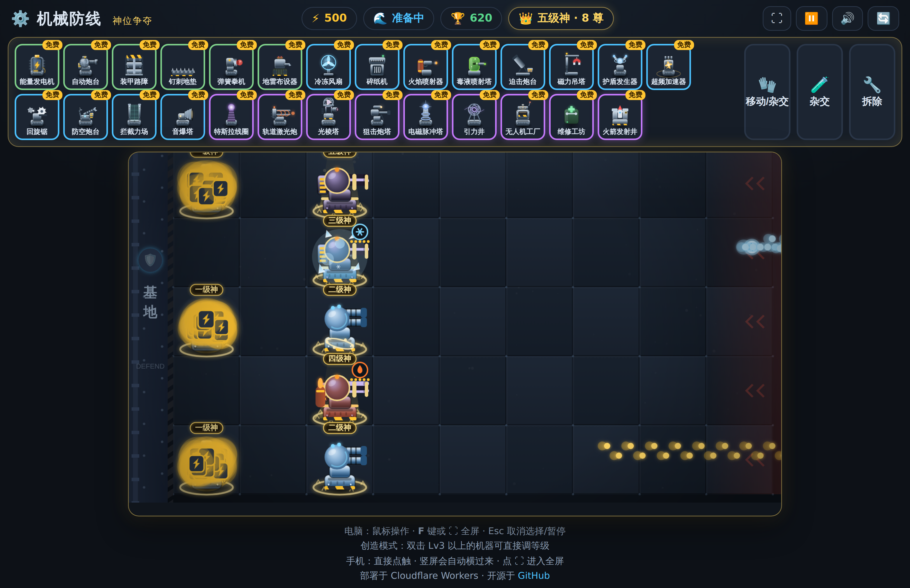
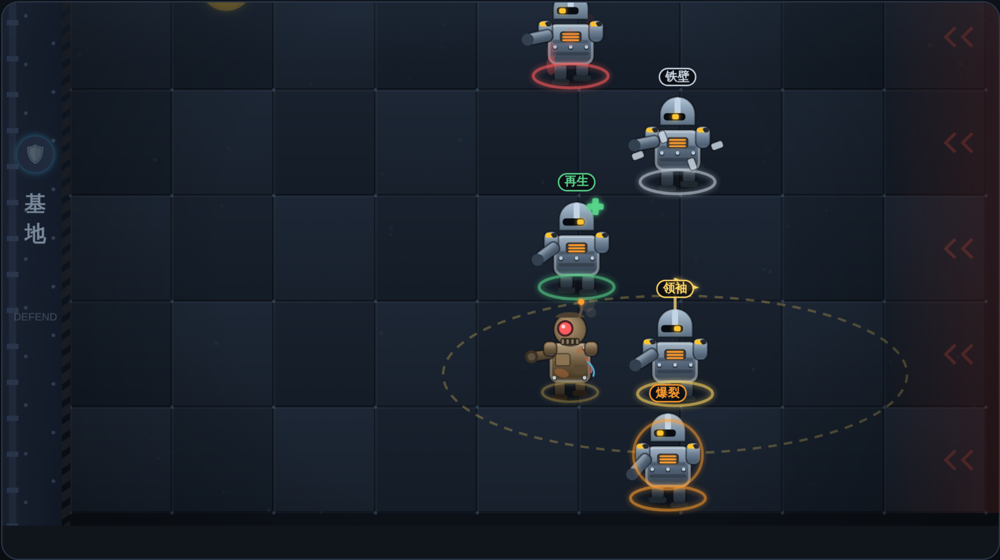
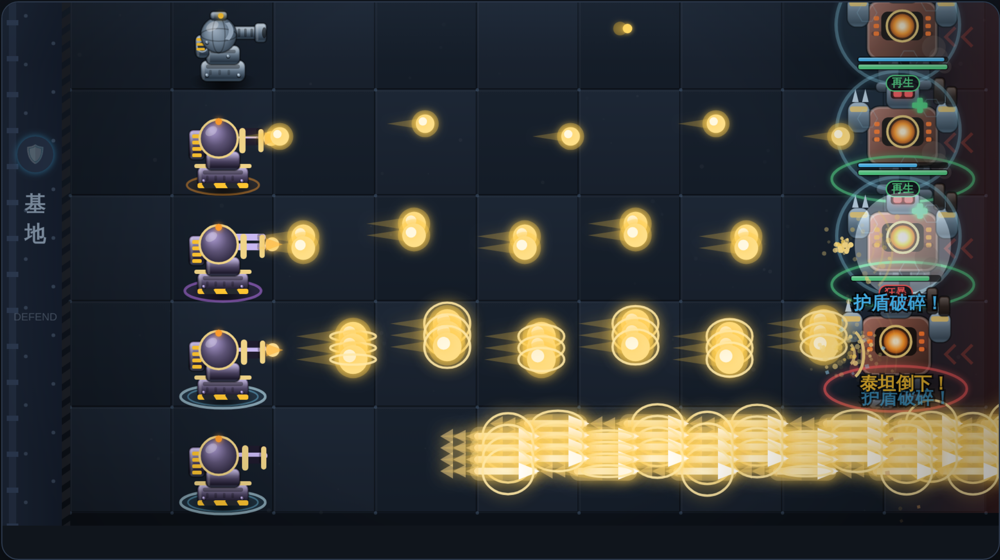
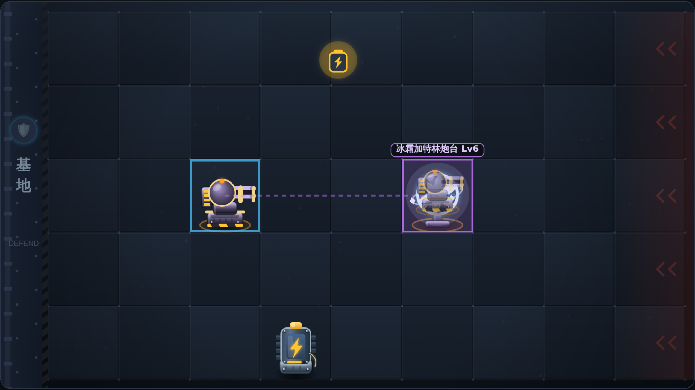
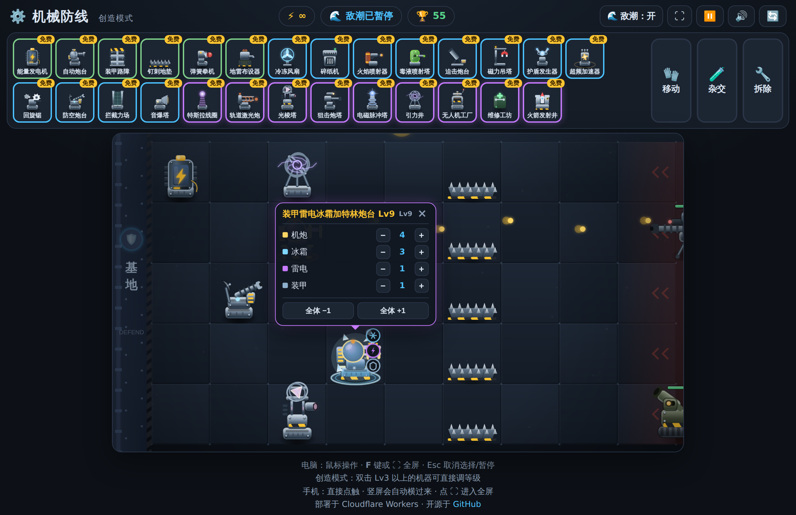

# ⚙️ 机械防线 · 盲盒塔防

一个部署在 **Cloudflare Workers** 上的网页小游戏。玩法类似《植物大战僵尸》：
把盲盒直接放到战场上，**落地即开**，开出什么机器就地服役，抵挡一波波废铁机器人的进攻——
大嘴花变成了**碎纸机**，豌豆射手变成了**自动炮台**。

打开网页即玩，无需安装。**电脑一屏铺满、手机竖屏自动横过来**，触屏直接点。



## 📱 全屏 & 手机适配

| | 表现 |
| --- | --- |
| 🖥️ 电脑 | 页面**一屏铺满不滚动**，战场按窗口大小自动缩放并始终保持 940:526 比例；点 ⛶ 或按 <kbd>F</kbd> 进全屏 |
| 📱 手机横屏 | 卡槽自动竖排到屏幕左侧，战场吃满整块高度——比横排卡槽大 **26%** |
| 📱 手机竖屏 | **整个界面自动旋转 90°**，竖着拿也是完整的横屏战场，转动手机自动切回 |
| ⊞ 一屏选卡 | 手机上卡槽只能看到几张，点「**全部**」弹出一屏网格，27 种机器一次看完、点一下就选中 |
| 👆 长按查看 | 手机没有鼠标悬停，**长按机器**即可看到它的名字、耐久、护盾与全部能力 |
| 🔍 读数放大 | 画布被缩小后文字会看不清，飘字 / 波次横幅 / 血条会按屏幕尺寸**自动放大**补偿 |
| 🎯 触摸尺寸 | 手机上一格约 **57~68 实际像素**（远超 44px 推荐值），卡片与工具按钮同步放大 |
| 👆 触屏 | 点触即操作；屏蔽了双击缩放、双指缩放和下拉刷新，不会误触打断战斗 |
| 📐 刘海屏 | 用 `env(safe-area-inset-*)` 避开刘海与 home 条 |

进全屏时会尝试锁定横屏（安卓 Chrome 支持）；iPhone 上没有全屏 API，靠自动旋转铺满，⛶ 按钮会自动隐藏。

<p>


</p>

左：竖着拿手机，界面自动横过来铺满；右：点「全部」一屏选机器，灰掉的是能量不够或还在冷却。

## 🕹️ 四种模式

| 模式 | 玩法 |
| --- | --- |
| 🎁 盲盒模式 | 花 50⚡ 买盲盒放到战场，落地即开，开出什么用什么——拼手气 |
| 🃏 普通模式 | 经典种卡：全部 27 种机器一开始就在卡槽，按标价用能量放置，每张卡有独立冷却 |
| 🛠️ 创造模式 | 能量无限、机器免费无冷却、随便放随便杂交，敌潮一键开关，还能**双击机器直接调等级**——沙盒实验场 |
| 👑 神位争夺 | 所有机器开局即 **99999 级**，攻速与产能拉满；**两尊同阶神合成上一阶神**；僵尸血量同样 99999，敌潮三倍量 |

四种模式共用波次、杂交与手套；盲盒 / 普通 / 神位三个模式各有独立排行榜，创造模式不计成绩。

### 👑 神位争夺



一个把数值彻底拉爆、只比谁能堆到更高神阶的模式：

- **开局即神**：卡槽里所有机器免费无冷却，一落地就是 **99999 级**——
  但**长着一级机器的样子**，叫「一级神·自动炮台」
- **攻速与产能拉满**：炮台每 0.09 秒一发、发电机每 0.2 秒产 **99999 能量**，
  单发伤害 99999，普通僵尸一枪一个
- **合成神阶**：**两尊同阶神合成上一阶神**（一级神＋一级神＝二级神），
  异阶合成只取高阶。神阶越高，机体造型与神性特效越夸张——
  一级神是钢铁、二级神是合金、三级神起是秘金 + 旋转神纹，
  四阶起头顶星冕，五阶起脚下涌起神光
- **越往上越贵**：n 阶神要 2ⁿ⁻¹ 尊一级神，场上只有 45 格，
  能堆到几阶就是这个模式的成绩（登临新神阶额外加 神阶² × 1000 分）
- **僵尸也 99999**：所有敌人血量统一 99999（Boss 另有 99999 护盾），
  敌潮三倍量、出场间隔压到 28%，靠数量淹你

## 🎮 玩法

- **🎁 开盲盒**（盲盒模式）：花 50⚡ 买一个盲盒，点击战场空格放下——盒子抖动片刻当场炸开，随机机器就地部署！先选位置、后拼手气
- **🎲 概率**：普通 58% / 稀有 30% / 史诗 12%，连续 4 次普通后必出稀有以上（状态栏可见保底进度和最近开出记录）
- **⚠️ 风险**：未开封的盲盒也会被敌人攻击，别把盒子丢到机器人嘴边
- **🧤 手套 = 搬运 + 杂交**：点「移动/杂交」按钮后，**按住一台机器拖走**——
  拖到空格就是搬运，**拖到另一台机器身上就直接杂交**。松手前会实时预告合成结果的名字，
  没有冷却、也不用每次重新点按钮，可以一路拖着连锁合成
- **🧪 杂交按钮**：想要更稳的点选式也行——点「杂交」后依次点两台机器；
  合成完按钮**保持激活**，接着点下一对即可，**任意组合都能合**，详见下方杂交系统
- **🔬 调等级**（仅创造模式）：机器**总等级到 Lv3** 之后，空手**双击**它就会弹出调节面板，
  可以逐条能力 −/+ 调级，也能「全体 ±1」一把梭；能力降到 0 就把这条能力摘掉（至少保留一条）。
  等级掉回 Lv3 以下面板会自动收起，手套把机器搬走时面板也跟着走
- **⚡ 能量**：点击天上掉落的电池收集能量，能量发电机也会定期产电
- **🔧 拆除**：铲掉不想要的机器给好位置腾地方
- **🏆 排行榜**：盲盒模式与普通模式分开记录、分开排名
- **🛡️ 目标**：守住 10 波进攻，别让机器人冲进左侧基地；通关后可挑战无尽模式
- **👑 神位**（神位争夺）：顶栏实时显示当前最高神阶与场上神机数量，结算时记录本局登临的最高神位
- **🐢 节奏**：敌人移速偏慢但出场密、种类多，压力来自数量、远程火力与精英词缀
- **⚠️ 告急**：敌人越过第 3 列时屏幕四周泛红警戒 + 报警音，不会毫无预兆地就输掉
- **⚡ 突袭**：第 5 波起，波次推进到一半有概率**五路同时压上**——这是最容易翻车的时刻

### 机器图鉴（共 27 种）

| 机器 | 稀有度 | 普通模式价格/冷却 | 作用 |
| --- | --- | --- | --- |
| 能量发电机 | 普通 | 50⚡ / 5s | 每 7 秒产出 25 能量（向日葵） |
| 自动炮台 | 普通 | 100⚡ / 5s | 向前方持续发射能量弹（豌豆射手） |
| 装甲路障 | 普通 | 50⚡ / 15s | 高耐久，把敌人挡在身前（坚果墙） |
| 弹簧拳机 | 普通 | 100⚡ / 5s | 弹簧铁拳连续痛击身前敌人，近战无视护盾 |
| 冷冻风扇 | 稀有 | 150⚡ / 8s | 冰弹攻击并大幅减速敌人（寒冰射手） |
| 碎纸机 | 稀有 | 150⚡ / 12s | 把靠近的机器人整个粉碎，随后冷却（大嘴花） |
| 磁力吊塔 | 稀有 | 175⚡ / 12s | 定期把本行最靠近基地的敌人拖回后方 |
| 特斯拉线圈 | 史诗 | 250⚡ / 15s | 闪电链同时打击本行多个敌人 |
| 轨道激光炮 | 史诗 | 250⚡ / 15s | 激光贯穿本行所有敌人 |
| 地雷布设器 | 普通 | 100⚡ / 8s | 在本行前方埋设地雷，敌人踩中即爆炸 |
| 火焰喷射器 | 稀有 | 175⚡ / 10s | 向前喷火，范围灼烧并留下持续伤害 |
| 毒液喷射塔 | 稀有 | 175⚡ / 10s | 毒液弹让敌人中毒，持续掉血 |
| 迫击炮台 | 稀有 | 200⚡ / 12s | 曲射炮弹轰炸本行最远的敌人，落点范围溅射 |
| 狙击炮塔 | 史诗 | 275⚡ / 18s | **跨行**狙击全场血量最高的敌人，高额单体伤害 |
| 维修工坊 | 史诗 | 200⚡ / 15s | 持续修复周围 8 格内受损的机器 |
| 火箭发射井 | 史诗 | 200⚡ / 20s | 发射火箭贯穿全行，随后自动装填 15 秒（可重复使用） |
| 钉刺地垫 | 普通 | 75⚡ / 8s | 铺在地上的尖刺垫，敌人**可以走过去**但会被持续扎伤 |
| 护盾发生器 | 稀有 | 175⚡ / 14s | 定期给周围机器套上能量护盾，护盾先于血量承伤 |
| 超频加速器 | 稀有 | 200⚡ / 14s | 光环让相邻机器的攻击/产能速度大幅提升 |
| 回旋锯 | 稀有 | 200⚡ / 12s | 射出往返穿梭的锯片，来回切割整行敌人 |
| 电磁脉冲塔 | 史诗 | 250⚡ / 16s | 释放脉冲波，让本行敌人瘫痪数秒（含 Boss 减半） |
| 防空炮台 | 稀有 | 150⚡ / 10s | 高射速对空炮，**优先锁定飞行单位并造成双倍伤害** |
| 拦截力场 | 稀有 | 175⚡ / 14s | **拦下本行飞来的敌方炮弹**，专克远程部队 |
| 音爆塔 | 稀有 | 175⚡ / 12s | 扇形冲击波，伤害并把前方敌人**震退** |
| 光棱塔 | 史诗 | 275⚡ / 16s | 棱镜激光贯穿本行，命中处**再分裂到上下两行** |
| 引力井 | 史诗 | 250⚡ / 16s | 周期性把周围敌人拖住并**定身**数秒 |
| 无人机工厂 | 史诗 | 275⚡ / 18s | 定期放出**友方无人机**，自主追击场上的敌人 |

### ☠️ 精英词缀（危机感的来源）



从第 4 波起，普通杂兵会**随机挂上词缀**变成精英，出现率随波次上升到 26%。
同一只废铁机器人，挂了词缀就是完全不同的威胁：

| 词缀 | 效果 | 一眼认出 |
| --- | --- | --- |
| 🔴 狂暴 | 移速 x1.55、伤害 x1.5 | 红环 + 上窜怒焰 |
| ⚪ 铁壁 | 血量 x2.2，**远程伤害减免 45%** | 灰环 + 环绕装甲板 |
| 🟢 再生 | 每秒回复 3.5% 最大生命 | 绿环 + 治疗十字 |
| 🟡 领袖 | 周围 2 格友军**提速 25% 且减伤 18%** | 金旗 + 可见光环范围 |
| 🟠 爆裂 | 死亡时炸伤周围 8 格机器（260 伤害） | 橙色脉动环 |
| 🔵 迅捷 | 移速 x2，血量偏低（只给轻甲快兵） | 蓝色速度线 |

Boss 有一半概率带词缀，但不会拿到铁壁 / 领袖 / 迅捷——一个冲刺的泰坦没有任何反应余地，不好玩。
被领袖光环罩住的普通敌人脚下也会亮金圈，**先杀领袖**是这一波的解法。

### 💥 等级越高，火力越有排面



攻击特效按能力等级分 5 档，等级堆上去是**看得见**的：

| 等级 | 弹体 | 齐射 | 命中 |
| --- | --- | --- | --- |
| Lv1-2 | 小能量弹 | 1 发 | 小火花 |
| Lv3-4 | 加粗 + 拖尾 | 1 发 | 小火花 |
| Lv5-6 | 等离子球 | 2 发 | **冲击环** |
| Lv7-8 | 巨型球 + **旋转能量环** | 3 发 | 冲击环 + **小范围溅射** + 震屏 |
| Lv9+ | **贯穿光矛**（一发穿 4 个） | 4 发 | 全部 |

激光与闪电同样分档：越高越粗、加白热内核、沿途能量涟漪、分叉枝杈，高档开火会震屏。
满血一击秒杀会打出 **「处决！」** 与白色冲击环。

### 🧬 通用杂交系统（任意组合，能力与等级都无上限）



**任意两台机器都能杂交**——用手套把一台拖到另一台身上就行——产物还能继续杂交。
每台机器由若干"能力模块"组成，
**能力数量与等级理论上都没有上限**——想叠多少叠多少：

- **同类杂交 → 升级**：自动炮台＋自动炮台＝双管炮台，双管炮台＋双管炮台＝**加特林炮台**，
  之后继续叠就是加特林炮台 Lv4、Lv5、Lv22……射速与伤害一路成长（27 条进化线，每条前三级都有专属名字与造型）
- **异类杂交 → 叠能力**：碎纸机＋路障＝装甲碎纸机，再＋发电机＝充能装甲碎纸机，
  再叠雷电、冰霜、烈焰、剧毒……一台机器可以同时拥有任意多种能力
- **自动命名**：修饰词链拼出名字（冰霜自动炮台、充能装甲冰霜绞碎特斯拉线圈）；能力超过 5 种时用「全能」概括并标出总等级
- **外观真的会变**：副能力决定机体的**金属配色 + 外挂结构**——
  冰霜自动炮台是蓝色机体、身上凝着冰晶还飘雪；烈焰版是暗红机体挂着燃料罐与常燃火苗；
  剧毒版是绿色机体挂毒剂罐并滴落毒液；雷电版紫色机体侧挂电弧线圈；
  装甲版加挂裙板、充能版挂电池组、磁暴版顶着悬浮磁铁、轰爆版挂导弹巢……同一台炮台能有完全不同的样子
- **能力徽章**：机体边缘环绕显示副能力图标，超过 8 个折叠成 +N
- **调级面板**：创造模式里把机器堆到 Lv3 以上，双击就能直接改每条能力的等级——
  想试「冰霜 Lv9 + 雷电 Lv1」还是「全能力 Lv5」都不用再一台台杂交



- **模块协同**：带雷电模块的炮弹变成电弧弹跳弹，带冰霜模块的炮弹自带减速；冰霜 2 级起会轰出**冻结整行**的冰冻炮弹；
  碎纸机＋磁力＝隔空把敌人拖进来粉碎
- **经典组合**保留专属名字和造型：电弧机炮、磁力碎纸机、寒冰壁垒、冰冻弹簧炮（冻结整行 2 秒）
- **三级专属外观**：27 条进化线的每一级都有独立造型与材质——1 级钢铁、2 级蓝色合金、3 级紫金秘金。
  例如 装甲路障（钢板警戒条）→ **合金壁垒**（切角合金板 + 发光能量缝 + 六角螺栓）→ **千钧堡垒**（城垛 + 侧翼扶壁 + 能量核心 + 护盾波纹）；
  电池 → 聚变电站 → 核能核心（磁笼 + 旋转电子轨道）；特斯拉线圈 → 双球高压电塔 → 雷暴中枢（加速环 + 电弧）
- **武器表现**：火焰喷射器是**连续火舌**（多层火焰 + 抖动 + 飞散火星，3 级为白热蓝焰），不是子弹；
  灼烧/中毒以贴身轮廓与上浮火苗、气泡表现，不遮挡机体

### 🎨 美术

机器与敌人全部为手写 Canvas 矢量绘制，无任何图片资源：

- **统一光照**：金属渐变 + 左上轮廓光 + 柔和径向接触阴影 + 全场暗角，所有单位质感一致
- **敌人各具性格**：废铁机器人有焊补铁板/外露线束/冒烟排气，装甲机器人的目镜会左右扫描，
  盾卫的塔盾有发光能量纹、破盾后只剩残骸，冲刺机器人点火时拉出尾焰与速度线，
  弹跳机器人有真实压缩的弹簧腿，维修无人机带旋翼与治疗光环，钢铁泰坦有反应炉核心、
  肩甲尖刺、排气烟柱与六边形能量护盾
- **状态可读**：灼烧（橙色轮廓 + 上跳火苗）、中毒（绿色轮廓 + 上浮气泡）、冻结（冰块封印）
  一眼可辨，且不会因为叠加而糊成一团
- **性能**：渐变按内容缓存复用，辉光半径随场上单位数自适应；常规战斗 57fps，
  极端压力（45 台满级机器 + 40 敌人）仍有 30fps 以上
- **新单位造型**：狙击机器人是三脚架 + 长枪管 + 瞄准镜，蓄力时拉出红外瞄准线；榴弹车与火箭炮车是履带自走炮，
  炮管真的会仰起；电弧行者背着电容组、胸口高压环里跳电弧；激光无人机是环形机体挂激光吊舱；
  酸液喷吐者背着透明酸罐、戴防毒目镜、软管接到喷嘴；分裂机器人的左右半壳会呼吸式张合、透出壳里的两个小机体
- **材质升级**：所有金属板改用「顶光 → 本色 → 暗部 → 底部环境反射」四段渐变，机体不再像贴在黑背景上；
  螺栓有沉头孔与高光，底座有散热格栅和落地接触阴影；这些细节会随场上单位数自动降级，保证密集战斗不掉帧
- 合成度越高机体越华丽：金圈 → 橙色光环 → 紫色光环 → 青白双环

### 敌人图鉴（共 22 种，另有 4 种融合敌人）

| 敌人 | 特点 |
| --- | --- |
| 废铁机器人 | 基础杂兵 |
| 装甲机器人 | 高血量，行动稍慢 |
| 疾速无人机 | 速度极快，血量低 |
| 自爆无人蜂 | 快速飞行，撞上机器自爆造成大量伤害 |
| 盾卫机器人 | 前置护盾吸收远程子弹，近战机器可绕过 |
| 冲刺机器人 | 间歇性点燃推进器高速冲刺，突然突破防线 |
| 弹跳机器人 | 弹簧腿可以**跳过**挡路的机器（次数有限） |
| 维修无人机 | 飞行单位，持续治疗周围同伴，需要优先集火 |
| 重型碾压车 | 精英级，血厚攻高 |
| 分裂机器人 | 死亡时**裂成两个小机器人**继续推进，别留到最后 |
| 自愈机器人 | 持续自我修复，火力不够就永远打不死 |
| 隐匿机器人 | 周期性开启**光学迷彩**，迷彩期间免疫一切远程攻击，只能近战解决 |
| 钢铁泰坦 | **Boss**：4200 血 + 600 能量护盾，抗冻结，最终波压轴登场 |

**🎯 远程部队**（会在射程外停下来开火，逼你把火力往前推）：

| 远程敌人 | 射程 | 特点 |
| --- | --- | --- |
| 炮击机器人 | 3 格 | 液压支腿撑地、肩扛重炮，停在防线外一发发轰 |
| 酸液喷吐者 | 2.4 格 | 腐蚀弹命中后会**溅到上下相邻两行**，一发打三行 |
| 电弧行者 | 2.8 格 | 高压电弧命中后让机器**瘫痪 1.6 秒**，停止一切输出 |
| 激光无人机 | 3.2 格 | 飞行单位，1.2 秒一次的高频激光点射 |
| 榴弹车 | 3.5 格 | 曲射榴弹，落点**左右各溅一格**，一发打三台机器 |
| 导弹无人机 | 4 格 | 飞行单位，超远距离齐射导弹，命中会震屏 |
| 火箭炮车 | 5 格 | 精英级，一次**三连发**火箭齐射，每发都溅射 |
| 狙击机器人 | 6 格 | 隔着大半个战场蓄力，**红外瞄准线**亮起后一发 130 伤害 |
| 炮击泰坦 | 4.5 格 | **Boss**：5200 血 + 700 护盾 + 双肩重炮，无尽模式登场 |

**融合敌人**（两种敌人特性合体，第 8 波起登场）：

| 融合敌人 | 血统 | 特点 |
| --- | --- | --- |
| 疾冲盾卫 | 盾卫 ＋ 冲刺 | 举着圆盾高速冲锋，护盾挡子弹 |
| 弹跳自爆蜂 | 弹跳 ＋ 自爆蜂 | 弹簧腿跳过防线后再引爆，340 伤害 |
| 维修碾压车 | 维修机 ＋ 碾压车 | 1700 血的医疗涂装碾压车，边推进边治疗同伴 |
| 碾压泰坦 | 钢铁泰坦 ＋ 碾压车 | **终极 Boss**：6200 血 + 900 护盾 + 巨型尖钉滚筒，双反应炉，无尽模式登场 |

## 📁 项目结构

```
├── public/            # 静态页面（游戏本体，纯 Canvas，无外部依赖）
│   ├── index.html
│   └── game.js
├── src/
│   └── worker.js      # Cloudflare Worker：/api/* 排行榜接口 + 静态资源托管
├── wrangler.jsonc     # Workers 配置
└── package.json
```

## 🚀 部署到 Cloudflare Workers

### 方式一：GitHub 自动部署（推荐）

1. 打开 [Cloudflare 控制台](https://dash.cloudflare.com) → **Workers & Pages** → **Create** → **Workers** → **Connect to Git**
2. 选择本仓库，构建配置保持默认（部署命令 `npx wrangler deploy`）
3. 完成后每次 push 到默认分支都会自动构建部署

### 方式二：命令行手动部署

```bash
npm install
npx wrangler login
npm run deploy
```

### 本地开发

```bash
npm install
npm run dev     # http://localhost:8787
```

## 🏆 可选：启用云端排行榜

游戏默认可玩，排行榜数据存在浏览器本地。想让所有玩家共享排行榜，需要绑定一个 KV 命名空间：

```bash
npx wrangler kv namespace create SCORES
```

把命令输出的 `id` 填入 `wrangler.jsonc` 底部的 `kv_namespaces` 配置并取消注释，
重新部署即可。接口说明：

- `GET /api/scores?mode=box|classic` — 返回该模式前 20 名（两个模式分榜）
- `POST /api/scores` — 提交成绩 `{ name, score, wave, mode }`
- `GET /api/health` — 健康检查（`storage` 字段显示是否已启用 KV）

## 📐 开发规范

想用同一套做法开下一个游戏？[docs/GAME-DEV-GUIDE.md](docs/GAME-DEV-GUIDE.md) 沉淀了这个项目的
架构模式（数据表驱动、模块化能力系统）、纯矢量美术规范、移动端适配、
`window.__game` 调试接口 + Playwright 自动化测试流程、平衡与性能调参方法，以及踩过的坑清单。

## 🛠️ 技术说明

- 前端：原生 JavaScript + Canvas 2D，所有画面均为程序绘制，零图片资源、零依赖、单页即玩
- 自适应：CSS 弹性布局 + `ResizeObserver` 实时按可用空间给战场算精确像素；竖屏手机整体 `rotate(90deg)`，
  指针坐标做逆变换换算，触屏点击与鼠标点击走同一套命中逻辑
- 音效：WebAudio 实时合成（可静音）
- 后端：Cloudflare Worker 处理 `/api/*`，其余请求走 [Workers 静态资源](https://developers.cloudflare.com/workers/static-assets/)
- 排行榜：Workers KV（未配置时前端自动退回 localStorage）
